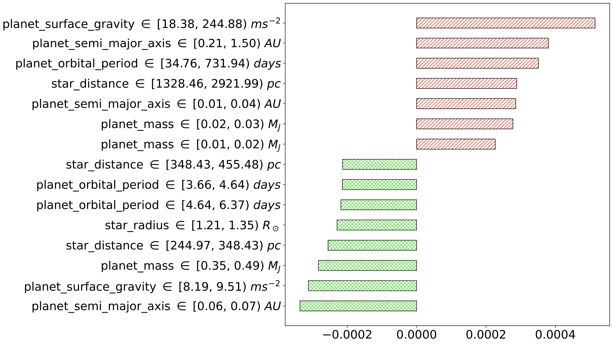

<!-- # Ex🪐plain -->

<p align="center">
  
</p>

We introduce Ex🪐plain, a model-agnostic framework to identify and describe exoplanetary characteristics that challenge atmospheric parameterization. 

------------------ 

## Papers
Code associated with the papers 
- [**"Bad Exoplanet! Explaining Degraded Performance when Reconstructing Exoplanets Atmospheric Parameters"**](https://openreview.net/forum?id=9Z4XZOhwiz&referrer=%5Bthe%20profile%20of%20Alkis%20Koudounas%5D(%2Fprofile%3Fid%3D~Alkis_Koudounas1)), accepted at NeurIPS AI4Science Workshop 2023
- [**"Ex(o)plain: Subgroup-level analysis of exoplanet atmospheric parameters"**](https://ieeexplore.ieee.org/document/10689522), accepted at IEEE Access 2024.

------------------ 

## Data
We do not include the dataset used in the paper as it is publicly available and downloadable from the [ARIEL Big Data Challenge official site](https://www.ariel-datachallenge.space/ML/download/).

------------------ 

## Get Started
Our code was tested on Python 3.10.4. To make it work, you will need a working environment with the libraries listed in `requirements.txt`.

## Running the Experiments
To reproduce the paper's experiments, you can directly run the `exoplain.ipynb` notebook, which leverages the predictions already computed for both the ensemble and the weak learners. 

------------------ 

## What you can do

### Individual model analysis
You can investigate the sources of errors for a model (e.g., the ensemble), and highlight the subgroups with the highest negative (or positive) divergence, as shown here:

<p align="center">
  
</p>

And plot the Shapley values of these subgroups to understand the impact of each single item on the performance of the model:

<p align="center">
  
</p>

### Model comparison analysis

You can also investigate the gain in performance at the subgroup level when changing one model (e.g., a weak learner) with another one (e.g., an ensemble). For example, the following table shows the subgroups that most benefit or fail to benefit when changing these two models:

<p align="center">
  
</p>

And plot the distribution of gain in performance for all the retrieved subgroups (cross-hatched green denotes performance improvement, while red indicates performance decrease):

<p align="center">
  
</p>


### Global divergence analysis
Finally, you can exploit the global Shapley values to investigate the impact of the items on the performance of the model. For example, the following image shows the top-15 items that have the highest impact on the performance for the ensemble (cross-hatched green denotes performance improvement, while red indicates performance decrease):

<p align="center">
  
</p>


## Citation
If you use this code in your research, please cite our papers:

```bibtex
@ARTICLE{10689522,
  author={Koudounas, Alkis and Giobergia, Flavio and Baralis, Elena},
  journal={IEEE Access}, 
  title={Ex(o)plain: Subgroup-level analysis of exoplanet atmospheric parameters}, 
  year={2024},
  volume={},
  number={},
  pages={1-1},
  keywords={Atmospheric modeling;Exoplanet;Atmospheric measurements;Computational modeling;Atmospheric waves;Metadata;Deep learning;Explainable AI;Detection algorithms;Deep Learning;Divergence;Exoplanet Atmospheric Parameters;Explainable AI;Subgroup Detection},
  doi={10.1109/ACCESS.2024.3466919}}
```

```bibtex
@inproceedings{koudounas2023bad,
  title={Bad Exoplanet! Explaining Degraded Performance when Reconstructing Exoplanets Atmospheric Parameters},
  author={Alkis Koudounas and Flavio Giobergia and Elena Baralis},
  booktitle={NeurIPS 2023 AI for Science Workshop},
  year={2023},
  url={https://openreview.net/forum?id=9Z4XZOhwiz}
}
```

<!-- ```
paper under submission
``` -->

## License
This code is released under the Apache 2.0 license. See the [LICENSE](LICENSE) file for more details.

## Contact
For any questions, please contact [Alkis Koudounas](mailto:alkis.koudounas@polito.it).
